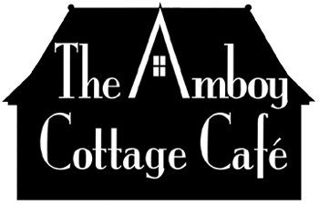

  
  # The Amboy Cottage Cafe
  

  
  
  
  
  ## Description
  This site is desiged for a local cafe.

  ### Tools and Languages used
  ##### Frontend:

  
  ##### Tools:
  GitHub
  
  ## Screenshots
  

  

  

  ## Links
  GitHub Repository: https://github.com/wizzle13/cottage-cafe

  GitHub URL: https://wizzle13.github.io/cottage-cafe

  &copy;2022 by Chris Burton
